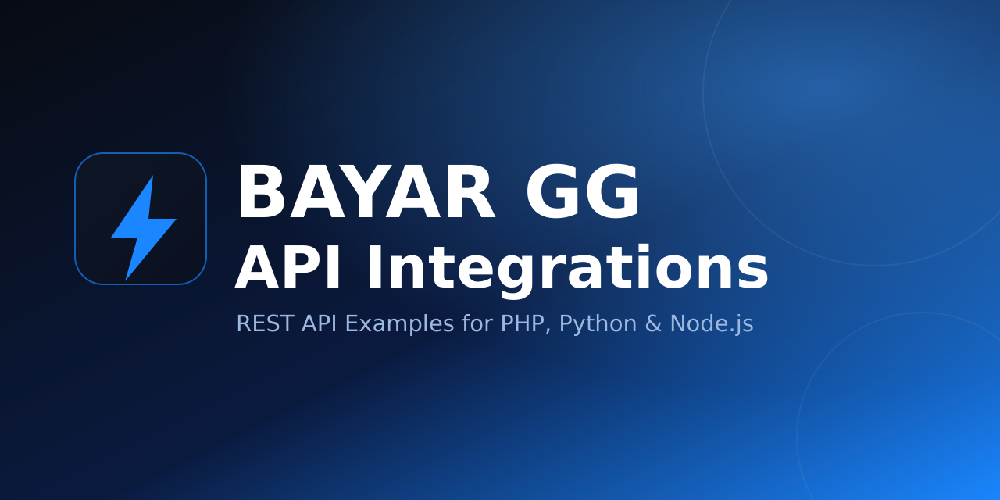

<p align="center">
  
</p>

<p align="center">
  <a href="https://www.bayar.gg"></a>
  
  
  
  
</p>

# BAYAR GG API Integrations

Contoh integrasi **resmi** untuk REST API BAYAR GG — endpoint yang sama dengan yang tampil di **[API Docs](https://www.bayar.gg/api-docs)** — dalam **PHP**, **Python**, dan **Node.js**.

Dengan kit ini Anda bisa langsung: membuat payment link (QRIS & metode lain), cek status invoice, baca riwayat transaksi, convert QRIS statis → dinamis, kelola produk digital & order WhatsApp Store, serta menerima webhook callback dari website/backend sendiri.

> **Base URL produksi:** `https://www.bayar.gg/api`
> **API Docs:** https://www.bayar.gg/api-docs · **Dashboard:** https://www.bayar.gg/dashboard

---

## Daftar Isi

- [Fitur](#fitur)
- [Struktur Repository](#struktur-repository)
- [Clone](#clone)
- [Quick Start](#quick-start)
- [Autentikasi](#autentikasi)
- [Metode Pembayaran](#metode-pembayaran)
- [Referensi Endpoint](#referensi-endpoint)
- [Contoh cURL](#contoh-curl)
- [Webhook / Callback](#webhook--callback)
- [Fitur Premium](#fitur-premium)
- [Penanganan Error](#penanganan-error)
- [Keamanan](#keamanan)
- [Dukungan](#dukungan)

---

## Fitur

- Buat payment link QRIS / metode pembayaran aktif (`create-payment`).
- Cek status invoice & riwayat pembayaran (`check-payment`, `list-payments`).
- Daftar metode pembayaran, status akun, dan statistik (`get-payment-methods`, `get-account-status`, `get-statistics`).
- QRIS Converter: ubah QRIS statis menjadi QRIS dinamis bernominal (`qris-convert`, `qris-info`).
- Digital Product API: file, hidden content, dan foto produk (`list-files`, `list-contents`, `list-images`).
- WhatsApp Store API: daftar & selesaikan order (`wa-store-orders`, `wa-store-complete`).
- **Merchant API**: hubungkan & baca akun OVO / BRI / GoPay / Livin' (`accounts-connect`) — paket Premium.
- Webhook callback otomatis saat pembayaran sukses.
- **Plugin WooCommerce** (repo terpisah): **[bayargg-woocommerce](https://github.com/bayar-global-gateway/bayargg-woocommerce)** — terima QRIS/e-wallet di toko WordPress, lengkap dengan panduan instalasi.

---

## Struktur Repository

```text
.
├── README.md
├── .env.example                 # Contoh environment variable
├── .gitignore
├── docs/
│   ├── api-docs-endpoints.md    # Daftar endpoint sesuai API Docs
│   ├── endpoints.json           # Daftar endpoint machine-readable
│   ├── tutorial-lengkap.md      # Tutorial integrasi lengkap
│   └── webhooks.md              # Referensi webhook callback
└── examples/
    ├── php/                     # Client + contoh PHP
    │   ├── BayarGgClient.php
    │   └── example.php
    ├── python/                  # Client + contoh Python
    │   ├── bayar_gg_client.py
    │   ├── example.py
    │   └── requirements.txt
    ├── nodejs/                  # Client + contoh Node.js (ESM)
    │   ├── bayar-gg-client.mjs
    │   ├── example.mjs
    │   └── package.json
    ├── cli/                     # CLI siap pakai (PHP / Python / Node.js)
    │   ├── bayar-gg-cli.php
    │   ├── bayar_gg_cli.py
    │   └── bayar-gg-cli.mjs
    └── web/                     # Demo checkout web
        ├── php/index.php
        ├── python/app.py        # Flask
        └── nodejs/server.mjs    # Express
```

---

## Clone

```bash
git clone https://github.com/bayar-global-gateway/bayargg-api-integrations.git
cd bayargg-api-integrations
```

---

## Quick Start

Ambil **API Key** di [Dashboard](https://www.bayar.gg/dashboard) (menu API/Settings), lalu simpan sebagai environment variable — **jangan** hardcode di source code.

```bash
export BAYAR_GG_API_KEY="YOUR_API_KEY_HERE"
export BAYAR_GG_BASE_URL="https://www.bayar.gg/api"
```

### PHP

```bash
cd examples/php
php example.php
```

### Python

```bash
cd examples/python
python3 -m pip install -r requirements.txt
python3 example.py
```

### Node.js

```bash
cd examples/nodejs
npm install
node example.mjs
```

### CLI

```bash
# PHP
php examples/cli/bayar-gg-cli.php create-payment --amount=10000 --description="Order A" --payment-method=qris --payment-url=https://www.bayar.gg/pay

# Python
python3 examples/cli/bayar_gg_cli.py create --amount=10000 --description="Order A" --payment-method=qris --payment-url=https://www.bayar.gg/pay

# Node.js
node examples/cli/bayar-gg-cli.mjs create --amount=10000 --description="Order A" --payment-method=qris --payment-url=https://www.bayar.gg/pay
```

---

## Autentikasi

Setiap request menyertakan API key lewat header (disarankan) atau query string:

```http
X-API-Key: YOUR_API_KEY_HERE
Accept: application/json
Content-Type: application/json
```

Alternatif query: `?apiKey=YOUR_API_KEY_HERE`.

---

## Metode Pembayaran

| Kode | Keterangan |
| --- | --- |
| `qris` | QRIS Admin (default, maks Rp 500.000) |
| `qris_bayar_gg` | QRIS BAYAR GG (dinamis per-merchant, mID sendiri, webhook otomatis) |
| `qris_user` | BRI Merchant QRIS (dana langsung ke rekening BRI) |
| `qris_livin` | Livin' Merchant QRIS (settlement Bank Mandiri) |
| `gopay_qris` | GoPay Merchant QRIS |
| `ovo` | OVO Direct Payment |

> Ketersediaan metode bergantung pada fitur/langganan/koneksi merchant akun Anda. Cek `get-payment-methods.php` & `get-account-status.php`.

---

## Referensi Endpoint

Semua path relatif terhadap `https://www.bayar.gg/api`.

| Method | Endpoint | Fungsi |
| --- | --- | --- |
| `POST` | `/create-payment.php` | Buat payment link / invoice baru |
| `GET` | `/check-payment.php` | Cek status invoice |
| `GET` | `/list-payments.php` | Riwayat pembayaran (filter & paging) |
| `GET` | `/get-payment-methods.php` | Metode pembayaran yang tersedia |
| `GET` | `/get-account-status.php` | Status akun, koneksi merchant & fitur |
| `GET` | `/get-statistics.php` | Statistik pembayaran |
| `POST` | `/qris-convert.php` | Convert QRIS statis → dinamis bernominal |
| `POST` | `/qris-info.php` | Decode informasi QRIS |
| `GET` | `/list-files.php` | Daftar file digital |
| `GET` | `/list-contents.php` | Daftar hidden content |
| `GET` | `/list-images.php` | Daftar foto produk |
| `GET` | `/wa-store-orders.php` | Daftar order WhatsApp Store |
| `POST` | `/wa-store-complete.php` | Tandai order WhatsApp Store selesai |
| `GET` | `/accounts-connect.php` | Merchant API: status / info / balance / history |
| `POST` | `/accounts-connect.php` | Merchant API: connect / set_qris / disconnect |

### POST `/create-payment.php`

Body (field `amount` & `payment_url` wajib; `amount` minimal `1000`):

```json
{
  "amount": 10000,
  "description": "Pembayaran Produk A",
  "customer_name": "Budi",
  "customer_email": "budi@example.com",
  "customer_phone": "6281234567890",
  "callback_url": "https://example.com/webhook/bayar-gg",
  "redirect_url": "https://example.com/thank-you",
  "payment_url": "https://www.bayar.gg/pay",
  "payment_method": "qris_bayar_gg",
  "file_id": "",
  "content_id": "",
  "product_image_id": "",
  "use_qris_converter": false
}
```

Respons sukses:

```json
{
  "success": true,
  "data": {
    "invoice_id": "PAY-username-1751030400-AB12CD",
    "amount": 10000,
    "final_amount": 10157,
    "payment_url": "https://www.bayar.gg/pay?invoice=PAY-username-1751030400-AB12CD",
    "qris_string": "00020101021226...",
    "status": "pending",
    "expires_at": "2026-06-28 13:00:00",
    "payment_method": "qris_bayar_gg",
    "payment_method_label": "QRIS BAYAR GG"
  }
}
```

> `payment_url` wajib dikirim sebagai string. Gunakan `https://www.bayar.gg/pay` untuk checkout default BAYAR GG, atau URL custom yang sudah aktif di menu **Checkout URL**. `file_id` / `content_id` / `product_image_id` menautkan produk digital ke invoice.

### GET `/check-payment.php`

```text
/check-payment.php?invoice=PAY-username-1751030400-AB12CD
```

### GET `/list-payments.php`

Query: `search`, `status`, `payment_method`, `paid_via`, `start_date`, `end_date`, `page` (default 1), `limit` (default 10).

### POST `/qris-convert.php`

```json
{ "qris": "00020101021126...", "nominal": 50000 }
```

### WhatsApp Store

```text
GET  /wa-store-orders.php?status=&search=&limit=50&offset=0
POST /wa-store-complete.php   { "order_number": "WA260403-XXXX", "status": "completed", "notify": true }
```

### Merchant API (`/accounts-connect.php`)

Hubungkan & baca akun merchant **OVO**, **BRI**, **GoPay**, **Livin' by Mandiri** lewat API. **Butuh paket Premium "Semua Fitur"** (tanpa itu → `HTTP 402`). `provider`: `ovo` | `bri` | `gopay` | `livin`.

```text
# Baca
GET  /accounts-connect.php?action=status
GET  /accounts-connect.php?provider=livin&action=info
GET  /accounts-connect.php?provider=gopay&action=balance
GET  /accounts-connect.php?provider=bri&action=history&limit=10

# Connect (POST body JSON)
BRI    { "provider":"bri","action":"connect","host":"brimerchant.bri.co.id","username":"","password":"","mid":"","tid":"" }
Livin  { "provider":"livin","action":"connect","phone":"","password":"" }  ->  { "action":"select_outlet","connect_token":"cs_xxx","outlet_id":"..." }
OVO    otp_send -> otp_verify(otp) -> pin(pin)                 (bawa connect_token tiap langkah)
GoPay  otp_start -> otp_initiate(method) -> otp_verify(otp) -> select_account(account_id)

# QRIS statis (bri|livin) & putus
POST /accounts-connect.php  { "provider":"bri","action":"set_qris","qris_string":"00020101..." }
POST /accounts-connect.php  { "provider":"ovo","action":"disconnect" }
```

Contoh client: `merchantStatus()`, `merchantInfo()`, `merchantBalance()`, `merchantHistory()`, `merchantConnect()`, `merchantSetQris()`, `merchantDisconnect()` (PHP/Node) · `merchant_status()`, `merchant_connect()`, dst. (Python). CLI: `merchant-status`, `merchant-info`, `merchant-connect`, dst.

Daftar endpoint lengkap: [`docs/api-docs-endpoints.md`](docs/api-docs-endpoints.md) · versi machine-readable: [`docs/endpoints.json`](docs/endpoints.json).

---

## Contoh cURL

Buat payment link:

```bash
curl -X POST https://www.bayar.gg/api/create-payment.php \
  -H "Content-Type: application/json" \
  -H "X-API-Key: YOUR_API_KEY_HERE" \
  -d '{
    "amount": 10000,
    "description": "Pembayaran Produk A",
    "customer_name": "Budi",
    "callback_url": "https://example.com/webhook/bayar-gg",
    "redirect_url": "https://example.com/thank-you",
    "payment_url": "https://www.bayar.gg/pay",
    "payment_method": "qris_bayar_gg"
  }'
```

Cek status invoice:

```bash
curl -H "X-API-Key: YOUR_API_KEY_HERE" \
  "https://www.bayar.gg/api/check-payment.php?invoice=PAY-username-1751030400-AB12CD"
```

---

## Webhook / Callback

Jika `callback_url` dikirim saat create payment, BAYAR GG akan melakukan `POST` JSON ke URL tersebut ketika status pembayaran berubah menjadi **paid**. Verifikasi signature/secret di server Anda sebelum memproses, dan balas `HTTP 200` agar tidak di-retry.

Referensi lengkap (payload, header, verifikasi, retry): [`docs/webhooks.md`](docs/webhooks.md).

---

## Fitur Premium

| Fitur | Keterangan |
| --- | --- |
| QRIS BAYAR GG | QRIS dinamis per-merchant dengan mID sendiri, webhook otomatis, settlement provider |
| BRI Merchant QRIS | QRIS BRI merchant sendiri, dana langsung ke rekening BRI |
| GoPay Merchant QRIS | Hubungkan akun GoPay Merchant via OTP |
| Livin' Merchant QRIS | Hubungkan akun Livin' Merchant (Bank Mandiri), settlement ke rekening Mandiri |
| OVO Direct Payment | Auto-matching mutasi pembayaran OVO |
| QRIS Converter | Convert QRIS statis menjadi dinamis bernominal |
| Webhook Callback | Notifikasi otomatis ke backend Anda |

---

## Penanganan Error

Respons error selalu `success: false` dengan pesan pada `error`, dan HTTP status yang sesuai (`400` validasi, `401/403` auth, `429` rate limit, `5xx` server):

```json
{ "success": false, "error": "Amount is required and must be numeric" }
```

Selalu cek field `success` sebelum membaca `data`.

---

## Keamanan

- Simpan API key di environment variable / secret manager, **bukan** di repo atau kode klien.
- Lakukan panggilan API hanya dari **server**, bukan dari browser.
- Verifikasi webhook di sisi server sebelum menandai order lunas.
- Gunakan HTTPS untuk `callback_url` dan `redirect_url`.

---

## Dukungan

- **API Docs:** https://www.bayar.gg/api-docs
- **Dashboard:** https://www.bayar.gg/dashboard
- **Auto Integrate AI:** https://www.bayar.gg/auto-integrate
- **Email:** support@bayar.gg

---

## Lisensi

Dirilis di bawah lisensi **MIT** — bebas dipakai, disalin, dan dimodifikasi untuk integrasi Anda. Lihat berkas [LICENSE](LICENSE).

© BAYAR GG (PT BAYAR GLOBAL GATEWAY). Contoh integrasi resmi untuk penggunaan dengan layanan BAYAR GG.
